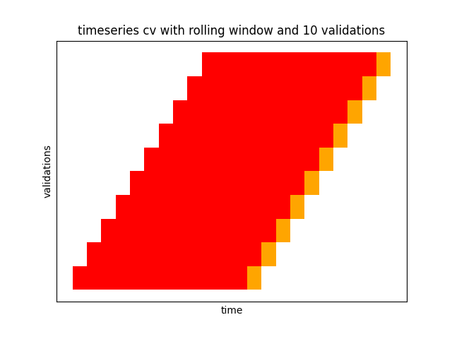
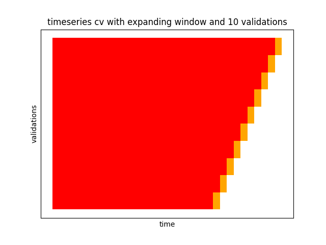

## time series splitter:
- it is important to validate our models with test & validation data sets and in the case of time series, these should respect the order of time (i.e. training sets precede validations sets)
- this is otherwise known as time series nested cross validation
- useful for learning how good our models are and comparing which model is best if you have many in a robust way

# time series splitter
## time_series_splitter
### class: TimeSeriesSplitter(self, X, y)
#### Parameters
##### X
 - numpy.array, list, pandas.DataFrame, pandas.Series
 - can be one or two-dimensional
##### y
 - numpy.array, list, pandas.DataFrame, pandas.Series
 - must be one-dimensional

## methods
### TimeSeriesSplitter.split(self, test_periods: int, train_periods: int = None, min_train_periods: int = None, n_validations: int = None, window_type: str = 'expanding')
 - splits the timeseries splitter objects based on requirements
#### Parameters
##### test_periods
 - the length of the testing period in whichever units supplied in data.
 - the validation periods will match this length.
##### train_periods
 - only compatible with window_type='rolling'
 - the length of the training period in whichever units supplied in data
##### min_train_periods
 - only compatible with window_type='expanding'
 - the starting length of the training period in whichever units supplied
##### window_type
 - either 'expanding' or 'rolling'
 - in 'rolling' the training periods will be the same length for each validation set
 - for 'expanding' the training periods will increase with each validation set to make the most of the data supplied
##### n_validations
 - number of validations periods required
 - if None, this will be calculated based on other parameters
### TimeSeriesSplitter.plot(self)
 - plots a Gantt style graph to help visualise each training & validation set

## attributes
### self.rows
 - returns number of rows in timeseries data
### self.row_index
 - returns index like object to represent rows in timeseries data
### self.window_type
 - returns window type
### self.n_validations
  - returns number of validation periods
### self.min_train_periods
  - returns number of training periods in first validation set start & end
### self.training_indices
  - returns list of tuples representing the indices for each training set start & end
  - note (0, 100) is 0 to 99 inclusive
### self.validation_indices
  - returns list of tuples representing the indices for each validation set start & end
  - note (0, 100) is 0 to 99 inclusive
### self.training_validation_indices
  - returns list of tuples representing the indices for each validation set start & end
  - note (0, 100) is 0 to 99 inclusive
### TimeSeriesSplitter.training_validation_data
 - returns list of tuples containing array of values for each training and validation pair

## examples
<p float="left">
  
   
</p>

```
from time_series_splitter import TimeSeriesSplitter
from sklearn.linear_model import LinearRegression
from sklearn.metrics import mean_squared_error
import numpy as np

# initialise TimeSeriesSplitter object
array2d = np.arange(4000).reshape((1000, 4))
array1d = np.arange(1000)
tss = TimeSeriesSplitter(x=array2d, y=array1d)
tss.split(test_periods=30, min_train_periods=365, n_validations=10)

# visualise how split looks
tss.plot()

# validate model
model = LinearRegression()
total_error = 0
for X_train, X_val, y_train, y_val in tss.training_validation_data:
    model.fit(X_train, y_train)
    y_pred = model.predict(X_val)
    total_error += mean_squared_error(y_val, y_pred, squared=False)
    
avg_error = total_error / tss.n_validations
```